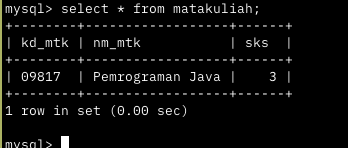
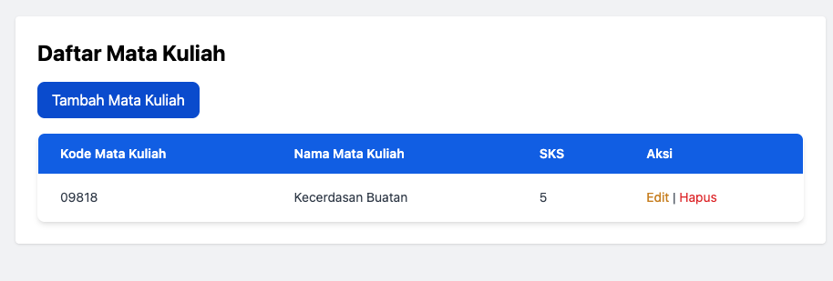
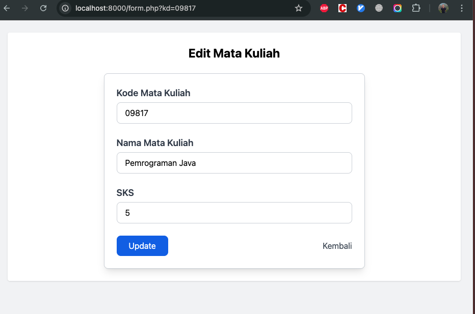
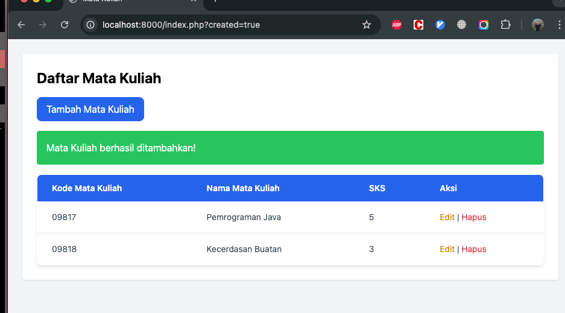
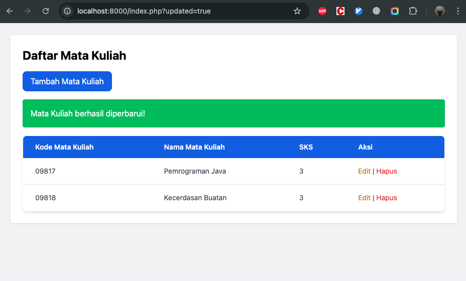
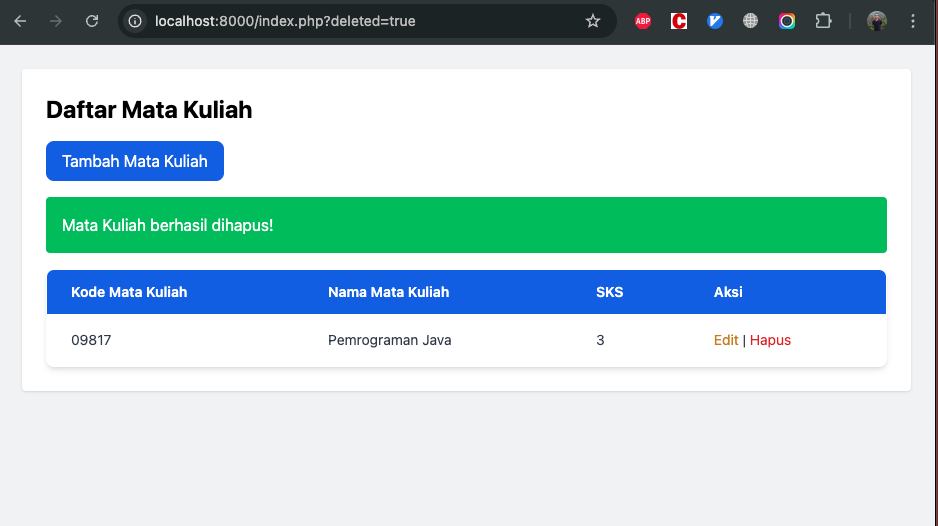

# 📚 Sistem Manajemen Mata Kuliah

Aplikasi web sederhana untuk mengelola data mata kuliah menggunakan PHP dan MySQL. Mendukung fitur **CRUD (Create, Read, Update, Delete)** dengan tampilan sederhana dan responsif menggunakan Tailwind CSS.

---

## ✨ Fitur

- Menambahkan data mata kuliah
- Melihat daftar mata kuliah
- Mengedit data mata kuliah
- Menghapus data mata kuliah
- Tampilan sederhana dan responsif

## 📁 Struktur Folder

```

📁 config/
└── db.php # Koneksi database
📁 feature/
├── create_matakuliah.php
├── update_matakuliah.php
└── delete_matakuliah.php
📁 template/
├── header.php
└── footer.php
form.php
index.php

```

## 💡 Snippet Kode

### 1. Create (Tambah Data)

```php
<?php
include '../config/db.php';
if ($_SERVER['REQUEST_METHOD'] === 'POST') {
    $kd = $_POST['kd'];
    $nm = $_POST['nm'];
    $sks = $_POST['sks'];
    $stmt = $conn->prepare("INSERT INTO matakuliah (kd_mtk, nm_mtk, sks) VALUES (?, ?, ?)");
    $stmt->bind_param("ssi", $kd, $nm, $sks);
    $stmt->execute();
    header("Location: ../index.php?create=success");
}
?>
```

### 2. Read (Tampil Data)

```php
<?php
$stmt = $conn->prepare("SELECT * FROM matakuliah");
$stmt->execute();
$result = $stmt->get_result();
while ($row = $result->fetch_assoc()) {
    echo $row['kd_mtk'] . " - " . $row['nm_mtk'] . " (" . $row['sks'] . " SKS)";
}
?>
```

### 3. Update

```php
<?php
include '../config/db.php';
if ($_SERVER['REQUEST_METHOD'] === 'POST') {
    $kd = $_POST['kd'];
    $nm = $_POST['nm'];
    $sks = $_POST['sks'];
    $stmt = $conn->prepare("UPDATE matakuliah SET nm_mtk = ?, sks = ? WHERE kd_mtk = ?");
    $stmt->bind_param("sis", $nm, $sks, $kd);
    $stmt->execute();
    header("Location: ../index.php?update=success");
}
?>
```

### 4. Delete

```php
<?php
include '../config/db.php';
if (isset($_GET['kd'])) {
    $kd = $_GET['kd'];
    $stmt = $conn->prepare("DELETE FROM matakuliah WHERE kd_mtk = ?");
    $stmt->bind_param("s", $kd);
    $stmt->execute();
    header("Location: ../index.php?delete=success");
}
?>
```

---

## 🖼️ Screenshot

### Struktur Database



### Daftar Mata Kuliah



### Form Tambah / Edit



### Sukses Tambah



### Sukses Update



### Sukses Hapus



---

## ⚙️ Teknologi

- PHP (Native)
- MySQL
- HTML + Tailwind CSS

---

## 🚀 Cara Menjalankan

1. Clone repositori ini:

   ```bash
   git clone https://github.com/arisos/pwtm.git
   cd pwtm
   ```

2. Import database dari file `db.sql` ke phpMyAdmin atau MySQL CLI:

   ```bash
   mysql -u root -p nama_database < db.sql
   ```

3. Jalankan server lokal:

   ```bash
   php -S localhost:8000
   ```

4. Buka browser:

   ```
   http://localhost:8000
   ```

---

## 📄 Lisensi

Proyek ini bebas digunakan untuk keperluan pembelajaran dan pengembangan pribadi.
